# CIA World Factbooks Archive 1990-2025

A complete, structured archive of the CIA World Factbook spanning **36 years** (1990-2025), covering **281 entities** with **1,061,522 data fields** in a normalized SQLite database.

The CIA World Factbook was discontinued on **February 4, 2026**. This archive preserves every edition published since 1990 and creates a structured, queryable dataset.

**[Search the interactive archive](https://worldfactbookarchive.org/)** | **[Project documentation](https://milkmp.github.io/CIA-World-Factbooks-Archive-1990-2025/)**

> **Data Integrity:** No Factbook content is added or altered. The parsing process structures the CIA's raw text into queryable fields — removing formatting artifacts, sectioning headers, and deduplicating noise lines — but the actual data values are exactly as the CIA published them. The only additions to the source data are reference lookup tables (FIPS-to-ISO code mappings, entity classifications, COCOM regional assignments) that sit alongside the original data, not inside it.


## Database Statistics

| Metric | Value |
|--------|-------|
| **Years covered** | 1990-2025 (36 editions) |
| **Entities** | 281 (192 sovereign states, 65 territories, 6 disputed, and more) |
| **Country-year records** | 9,500 |
| **Category records** | 83,599 |
| **Data fields** | 1,061,522 |
| **Content size** | ~324 MB |
| **Field name variants** | 1,090 mapped to 416 canonical names |


## Data Sources

| Years | Source | Method |
|-------|--------|--------|
| 1990-1995, 1997-1999 | [Project Gutenberg](https://www.gutenberg.org/) | Plain text parsing (4 format variants across the decade) |
| 1996 | [CIA original](https://web.archive.org/web/19970528151800id_/http://www.odci.gov:80/cia/publications/nsolo/wfb-96.txt.gz) + Gutenberg | CIA's own text file from Wayback Machine (replaced truncated Gutenberg data for 7 countries) |
| 2000 | [Wayback Machine](https://web.archive.org/) | HTML zip download + classic format parser |
| 2001 | Project Gutenberg | Text fallback (HTML zip was corrupted) |
| 2002-2020 | Wayback Machine | HTML zip archives from cia.gov, 4 parser generations |
| 2021-2025 | [factbook/cache.factbook.json](https://github.com/factbook/cache.factbook.json) | Git history with year-end commit snapshots |

## Year-by-Year Breakdown

| Year | Source | Countries | Fields |
|------|--------|-----------|--------|
| 1990 | Text | 249 | 15,750 |
| 1991 | Text | 247 | 14,903 |
| 1992 | Text | 264 | 17,372 |
| 1993 | Text | 266 | 18,509 |
| 1994 | Text | 266 | 18,762 |
| 1995 | Text | 266 | 19,600 |
| 1996 | Text | 266 | 21,119 |
| 1997 | Text | 266 | 23,405 |
| 1998 | Text | 266 | 23,348 |
| 1999 | Text | 266 | 25,178 |
| 2000 | HTML | 267 | 25,724 |
| 2001 | Text | 265 | 27,281 |
| 2002 | HTML | 268 | 27,430 |
| 2003 | HTML | 268 | 28,676 |
| 2004 | HTML | 271 | 28,958 |
| 2005 | HTML | 271 | 28,728 |
| 2006 | HTML | 262 | 28,950 |
| 2007 | HTML | 259 | 29,096 |
| 2008 | HTML | 261 | 30,753 |
| 2009 | HTML | 260 | 30,818 |
| 2010 | HTML | 262 | 30,805 |
| 2011 | HTML | 262 | 33,634 |
| 2012 | HTML | 262 | 35,183 |
| 2013 | HTML | 267 | 36,729 |
| 2014 | HTML | 267 | 36,679 |
| 2015 | HTML | 266 | 36,868 |
| 2016 | HTML | 268 | 36,804 |
| 2017 | HTML | 268 | 37,046 |
| 2018 | HTML | 268 | 37,285 |
| 2019 | HTML | 268 | 37,394 |
| 2020 | HTML | 268 | 36,687 |
| 2021 | JSON | 260 | 39,714 |
| 2022 | JSON | 260 | 37,344 |
| 2023 | JSON | 260 | 37,558 |
| 2024 | JSON | 260 | 34,838 |
| 2025 | JSON | 260 | 32,594 |


## Repository Structure

```
data/
  master_countries.sql       # 281 canonical entities
  countries.sql              # 9,500 country-year records
  categories.sql             # 83,599 category records
  field_name_mappings.sql    # 1,090 field name standardization rules
  fields/
    country_fields_1990.sql.gz  # Split by year (36 gzipped files)
    ...
    country_fields_2025.sql.gz
schema/
  create_tables.sql          # DDL for all 5 tables
etl/
  build_archive.py           # HTML parser (2000-2020)
  load_gutenberg_years.py    # Text parser (1990-2001)
  reload_json_years.py       # JSON loader (2021-2025)
  build_field_mappings.py    # Field name standardization
  classify_entities.py       # Entity type classification
  repair_1996_truncated.py   # CIA original text parser for 7 truncated 1996 countries
  validate_integrity.py      # Data quality checks
  export_to_sqlite.py        # SQL Server -> SQLite export (with FTS5)
scripts/
  factbook_search.py         # Command-line search utility
  validate_cocom.py          # COCOM region validation
  validate_integrity.py      # Data integrity checks
queries/
  sample_queries.sql         # 18 analytical queries for Power BI / analysis
  search_cli.py              # Command-line search tool
docs/
  DATABASE_SCHEMA.md         # Table definitions and relationships
  ETL_PIPELINE.md            # How the archive was built
  FIELD_EVOLUTION.md         # How CIA field names changed over time
  METHODOLOGY.md             # Complete methodology: parsing, standardization, validation
  screenshots/               # 29 PNGs + 5 animated GIFs of the web application
  index.html                 # GitHub Pages static landing page
```

## ETL Pipeline & Python Scripts

There are **two ways** to get the data:

1. **Import the pre-built SQL dumps** (in `data/`) — no Python required. See [How to Restore](#how-to-restore) below.
2. **Re-run the ETL pipeline from scratch** — the Python scripts in `etl/` download raw Factbook data directly from their original sources (Wayback Machine, Project Gutenberg, GitHub), parse every format variant, and load the structured results into SQL Server via pyodbc. This is how the archive was originally built.

The raw CIA World Factbook changed format **at least 10 times** between 1990 and 2025. Every script in `etl/` exists because a previous version of the parser broke on a new year's data. The pipeline handles 4 plain-text format variants, 5 HTML layout generations, and a final JSON era — each requiring its own parser.

### Scripts

| Script | Lines | Years | What it does |
|--------|-------|-------|--------------|
| `build_archive.py` | 986 | 2000-2020 | Downloads HTML zips from the Wayback Machine, detects which of 5 HTML layouts each year uses, and parses fields. Handles CDX API fallback when downloads fail, filters template/print pages, and deduplicates entries. |
| `load_gutenberg_years.py` | 1,043 | 1990-2001 | Parses plain-text Gutenberg editions with 4 distinct format variants (tagged, asterisk, at-sign, colon). Includes fuzzy country name matching to handle aliases like "Burma" and "Ivory Coast." |
| `reload_json_years.py` | 413 | 2021-2025 | Checks out year-end git commits from the factbook/cache.factbook.json repo and loads structured JSON. Strips embedded HTML from content fields. |
| `build_field_mappings.py` | 783 | All | Maps 1,090 raw field name variants to 414 canonical names using a 7-rule system: identity, dash normalization, CIA renames, consolidation, country-specific entries, noise detection, and manual review. |
| `classify_entities.py` | 283 | All | Auto-classifies 281 entities into 9 types (sovereign, territory, disputed, etc.) based on Dependency Status and Government Type fields, with hardcoded overrides for edge cases. |
| `repair_1996_truncated.py` | 189 | 1996 | Parses CIA's original `wfb-96.txt.gz` (page-header format with centered country/section names) and replaces truncated Gutenberg entries for 7 countries: Venezuela, Armenia, Greece, Luxembourg, Malta, Monaco, Tuvalu. |
| `validate_integrity.py` | 296 | All | Read-only validation suite with 9 checks: field count benchmarks, US population/GDP ground truth, year-over-year consistency, source provenance, and NULL detection. |

### Why parsing was so difficult

The CIA never maintained a stable schema. Every few years the HTML layout changed completely, field names were renamed without notice, and entire categories were restructured. Examples:

- **1990-1999 (plain text):** Four different formatting conventions across the decade. 1990-1993 used `Country: Name` headers with indented fields. 1994 introduced tagged markers (`_@_`, `_*_`, `_#_`). 1996 switched to bare section headers with no markers at all. 1999 changed the delimiter scheme again. Each variant required its own regex-based parser.

- **2000-2020 (HTML):** The CIA redesigned the Factbook website at least 5 times. The 2000 edition used `<b>FieldName:</b>` inline formatting. By 2004 it switched to `<td class="FieldLabel">` table layouts. 2008 introduced CollapsiblePanel JavaScript widgets. 2014 changed to expand/collapse `<h2>` sections. 2017 moved to field-anchor `<div>` structures. A parser that worked on 2006 data would produce garbage on 2010 data.

- **2001:** The Wayback Machine's HTML zip for 2001 was corrupted, so parsing fell back to the Project Gutenberg plain-text edition — the only year where the HTML and text pipelines had to swap.

- **Field name drift:** The CIA renamed fields silently over the decades. "GDP - real growth rate" became "Real GDP growth rate." "Telephones" split into "Telephones - fixed lines" and "Telephones - mobile cellular." Oil sub-fields were consolidated into "Petroleum." The `build_field_mappings.py` script maps all 1,090 variants through 7 rule layers to maintain time-series continuity.

- **Country-specific noise:** 1990s editions embedded government body names (parliaments, assemblies, courts) as top-level fields. Dissolved countries (Serbia and Montenegro, Netherlands Antilles) appear and disappear. Turkish Cyprus, Malaysian states, and Netherlands Antilles islands show up as sub-entries that need special handling.

See [docs/METHODOLOGY.md](docs/METHODOLOGY.md) and [docs/ETL_PIPELINE.md](docs/ETL_PIPELINE.md) for the full technical details.

## How to Restore

### Prerequisites
- SQL Server 2017+ (or Azure SQL)
- [ODBC Driver 18 for SQL Server](https://learn.microsoft.com/en-us/sql/connect/odbc/download-odbc-driver-for-sql-server)
- Python 3.8+ with `pyodbc` (for ETL scripts and CLI search tool)

### Steps

1. **Create the database:**
   ```sql
   CREATE DATABASE CIA_WorldFactbook;
   ```

2. **Run the schema script:**
   ```bash
   sqlcmd -S localhost -d CIA_WorldFactbook -i schema/create_tables.sql
   ```

3. **Import data (in order):**
   ```bash
   sqlcmd -S localhost -d CIA_WorldFactbook -i data/master_countries.sql
   sqlcmd -S localhost -d CIA_WorldFactbook -i data/countries.sql
   sqlcmd -S localhost -d CIA_WorldFactbook -i data/categories.sql
   sqlcmd -S localhost -d CIA_WorldFactbook -i data/field_name_mappings.sql
   ```

4. **Import field data (decompress and import each year):**
   ```bash
   cd data/fields
   # On Linux/macOS:
   for f in *.sql.gz; do gunzip -k "$f" && sqlcmd -S localhost -d CIA_WorldFactbook -i "${f%.gz}"; done
   # On Windows (PowerShell):
   Get-ChildItem *.sql.gz | ForEach-Object {
       $sql = $_.FullName -replace '\.gz$',''
       [System.IO.Compression.GZipStream]::new(
           [System.IO.File]::OpenRead($_.FullName),
           [System.IO.Compression.CompressionMode]::Decompress
       ).CopyTo([System.IO.File]::Create($sql))
       sqlcmd -S localhost -d CIA_WorldFactbook -i $sql
   }
   ```

5. **Verify:**
   ```sql
   SELECT COUNT(*) FROM CountryFields;  -- Should return 1,061,522
   ```

### Alternative: SQLite (No SQL Server Required)

A pre-built SQLite database (`factbook.db`, ~325 MB) is available as a release download for users who don't need SQL Server. The file exceeds GitHub's 100 MB file-size limit, so it is not included in the repository itself.

**Download:** [factbook.db from the latest release](https://github.com/MilkMp/CIA-World-Factbooks-Archive-1990-2025/releases/latest)

Place the downloaded file at `data/factbook.db` in the project root. SQLite requires no installation — Python's built-in `sqlite3` module can query it directly.

| | SQL Server | SQLite |
|--|-----------|--------|
| **Setup** | Install SQL Server + ODBC driver, run schema + import scripts | Download one `.db` file |
| **Size** | ~263 MB across 36 gzipped SQL files | ~324 MB single file |
| **Query tool** | SSMS, sqlcmd, pyodbc | Python `sqlite3`, DB Browser, any SQLite client |
| **Best for** | Power BI, enterprise analytics, large-scale joins | Quick exploration, scripting, lightweight apps |
| **Schema** | Identical 5-table structure | Identical 5-table structure |

The SQLite database contains the same 5 tables, same indexes, and same 1,061,522 fields as the SQL Server version, plus an FTS5 full-text search index for fast keyword and boolean search. This is what the [live webapp](https://worldfactbookarchive.org/) runs on.

**Note on numeric values:** The `CountryFields` table stores raw text content exactly as published by the CIA. There is no pre-computed `Value` column. The CSV and Excel exports on the webapp parse numeric values at download time using regex extraction. To extract numeric values yourself, join through `FieldNameMappings` and apply a pattern for the field you need:

```python
import sqlite3, re

db = sqlite3.connect("factbook.db")
db.row_factory = sqlite3.Row

# Example: extract Population as an integer
rows = db.execute("""
    SELECT c.Year, mc.CanonicalName, cf.Content
    FROM CountryFields cf
    JOIN Countries c ON cf.CountryID = c.CountryID
    JOIN MasterCountries mc ON c.MasterCountryID = mc.MasterCountryID
    JOIN FieldNameMappings fm ON cf.FieldName = fm.OriginalName
    WHERE fm.CanonicalName = 'Population'
    ORDER BY mc.CanonicalName, c.Year
""").fetchall()

for r in rows:
    m = re.search(r'[\d,]{5,}', r["Content"])
    value = int(m.group().replace(",", "")) if m else None
    if value:
        print(f"{r['CanonicalName']} ({r['Year']}): {value:,}")
```

Common extraction patterns for other fields:

| Field | Pattern | Example |
|-------|---------|---------|
| Population | `re.search(r'[\d,]{5,}', text)` &rarr; remove commas, cast to int | 331,449,281 |
| Real GDP per capita | `re.search(r'\$([\d,]+)', text)` &rarr; remove commas, cast to int | $63,500 |
| Life expectancy at birth | `re.search(r'total population:\s*([\d.]+)', text)` &rarr; float | 78.5 years |
| Population growth rate | `re.search(r'(-?[\d.]+)%', text)` &rarr; float | 0.7% |
| Military expenditures | `re.search(r'([\d.]+)%\s*of\s*G[DN]P', text)` &rarr; float | 3.45% of GDP |
| Area | `re.search(r'total\s*:?\s*([\d,]+)\s*sq\s*km', text)` &rarr; remove commas, cast to int | 9,833,517 sq km |
| Birth/Death rate | `re.search(r'([\d.]+)\s*(?:births\|deaths)\s*/\s*1,000', text)` &rarr; float | 11.0 births/1,000 |

## Live Web Application

The archive is served as a FastAPI + Jinja2 web application at **[worldfactbookarchive.org](https://worldfactbookarchive.org/)**. Key features:

- **Full-text search** with Library of Congress boolean syntax (AND, OR, NOT, "phrase", truncation)
- **Library** — card-based overview of the entire archive collection
- **Browse archive** by year (1990-2025) and country (281 entities)
- **Country profiles** with category drill-down, field time series, and data export (CSV, Excel, PDF)
- **Text diff** — side-by-side year comparison with highlighted changes for any country
- **Country dictionary** with ISO codes, entity types, and COCOM region assignments
- **Interactive maps gallery** — browsable country maps with search and filtering
- **Data export** — CSV, Excel, print-ready PDF reports, and a complete analysis-ready dataset download
- **Intelligence analysis dashboards** powered by Mapbox GL JS and Apache ECharts:
  - **Regional Dashboard** — global choropleth with 6 COCOM regions, hover popups, capital city markers, and click-to-zoom
  - **COCOM Region Detail** — per-region map with ranked bar charts for GDP, population, military spending
  - **Timeline Map** — animated choropleth across 36 years with multi-country time series and playback speed controls
  - **Map Compare** — two synced maps for side-by-side year comparison with shared color scale
  - **Communications Analysis** — internet, mobile, broadband penetration with digital divide indicators
  - **Global Trends** — multi-indicator time series for any country
  - **Global Rankings** — sortable country rankings by any indicator with year selection
  - **Change Detection** — year-over-year field changes with trend charts and region filtering
  - **Field Explorer** — browse all 416 canonical data fields with coverage statistics across 36 years
  - **Advanced Analytics Explorer** — correlation scatter, heatmap matrix, ranking race, and treemap visualizations
  - **Query Builder** — custom analytical queries across all indicators with flexible filters
  - **Trade Networks** — geographic and force-directed graph of global import/export relationships
  - **Organization Networks** — international organization memberships and alliance visualization
  - **Geopolitical Atlas** — territorial disputes and infrastructure mapping
  - **Political Stability** — government type choropleth, regime change tracking, and regional peer comparison
  - **Natural Resources & Economy** — resource production maps, commodity scatter plots, and country profiles
  - **Dissolved States** — historical entities no longer in the Factbook with archived indicator data
- **Intelligence dossiers** following ICD 203 analytic standards
- **Regional threat briefs** with instability and security indicators
- **Factbook Quiz** — 4 modes: country identification, capital cities, higher-or-lower, and flag recognition
- **Bug reporting** via GitHub Issues integration

**Stack:** Python 3.12, FastAPI, Jinja2, SQLite (FTS5), Mapbox GL JS v3, Apache ECharts 5, deployed on Fly.io.

The web application source code is maintained in a separate private repository.

## Entity Types

| Type | Count | Description |
|------|-------|-------------|
| sovereign | 192 | Independent states |
| territory | 65 | Dependencies, overseas territories |
| misc | 7 | Oceans, World, EU |
| disputed | 6 | Kosovo, Gaza Strip, West Bank, etc. |
| crown_dependency | 3 | Jersey, Guernsey, Isle of Man |
| freely_associated | 3 | Marshall Islands, Micronesia, Palau |
| special_admin | 2 | Hong Kong, Macau |
| dissolved | 2 | Netherlands Antilles, Serbia and Montenegro |
| antarctic | 1 | Antarctica |

## Field Name Standardization

The CIA renamed many fields over the 36-year span. The `FieldNameMappings` table maps 1,090 raw field name variants to 416 canonical names:

| Mapping Type | Count | Description |
|-------------|-------|-------------|
| identity | 184 | Modern field names (unchanged) |
| rename | 159 | CIA renamed the field (e.g. "GDP - real growth rate" -> "Real GDP growth rate") |
| dash_format | 64 | Formatting differences (single vs double dashes) |
| consolidation | 48 | Sub-fields merged into parents (e.g. Oil production/consumption -> Petroleum) |
| country_specific | 354 | Regional sub-entries, government body names |
| noise | 281 | Parser artifacts, fragments (flagged IsNoise=1) |

## Sample Queries

See [queries/sample_queries.sql](queries/sample_queries.sql) for 18 ready-to-use analytical queries, including:

- Population time series (single country)
- GDP comparison across G7 nations
- Military expenditure trends
- Internet users growth
- Countries that appear/disappear over time
- Consolidated petroleum sub-field view

## Screenshots

### Search & Browse
| | |
|---|---|
|  | 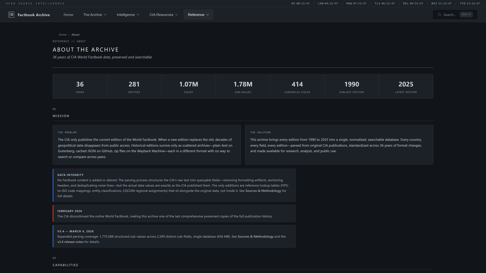 |
| **Homepage** — Database statistics, navigation, and live search | **About** — Project mission, architecture, and methodology |
|  |  |
| **Full-Text Search** — Keyword search across 1,061,522 fields | **Boolean Search** — AND/OR/NOT operators with phrase matching |

### The Archive
| | |
|---|---|
|  | 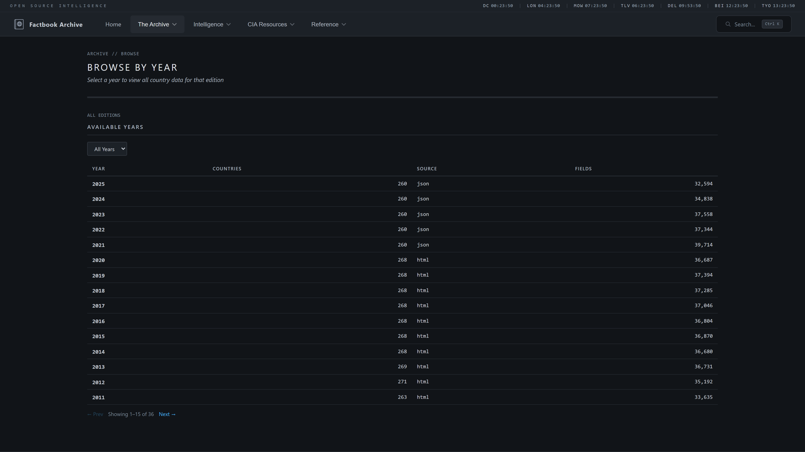 |
| **Library** — Card-based overview of the entire archive collection | **Browse Archive** — Navigate all 281 entities across 36 years |
|  |  |
| **Country Profile** — Complete factbook data by category | **Field Time Series** — Track any field across 36 years with Apache ECharts |
|  | 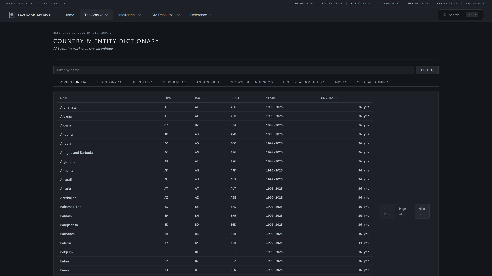 |
| **Data Export** — CSV, Excel, and print-ready PDF reports | **Country Dictionary** — All 281 entities with type, region, and ISO codes |
| 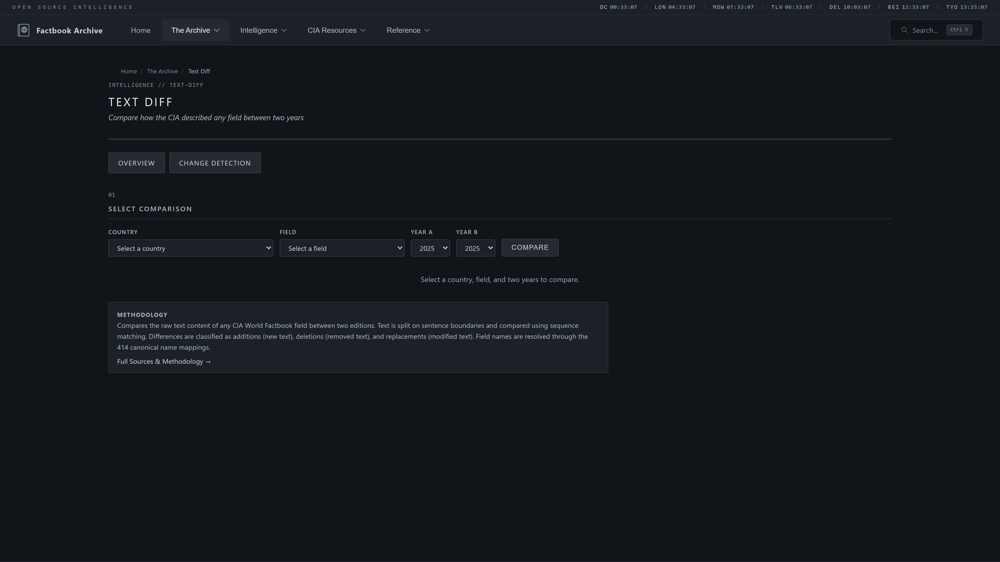 |  |
| **Text Diff** — Side-by-side year comparison with highlighted changes | **Factbook Quiz** — 4 game modes to test your world knowledge |

### Intelligence Analysis
| | |
|---|---|
|  |  |
| **Analysis Overview** — Available dashboards and analytical products | **Regional Dashboard** — Mapbox GL JS choropleth with hover popups, capital markers, and COCOM drill-down |
| 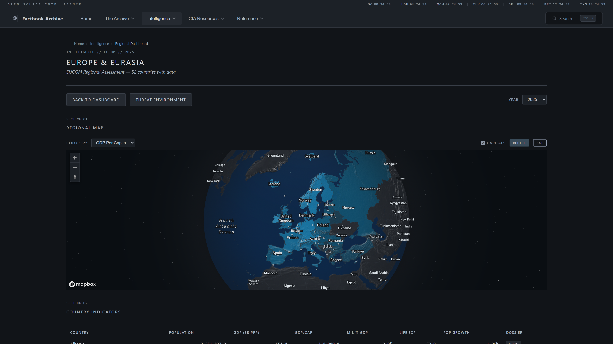 | 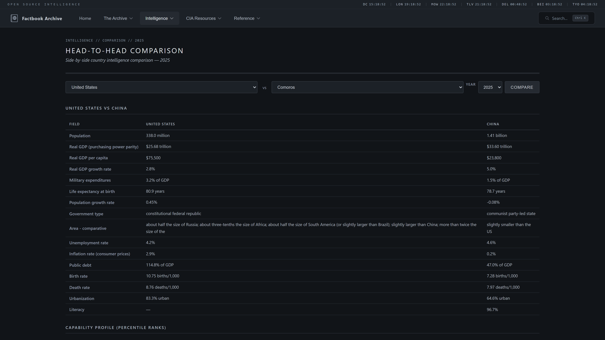 |
| **COCOM Region Detail** — Mapbox regional map with country-level KPIs | **Compare Countries** — Side-by-side comparison of any two nations |
|  | 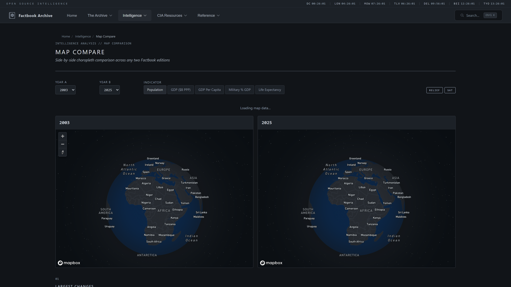 |
| **Timeline Map** — Animated Mapbox choropleth 1990-2025 with multi-country time series | **Map Compare** — Two synced Mapbox maps for side-by-side year comparison |
| 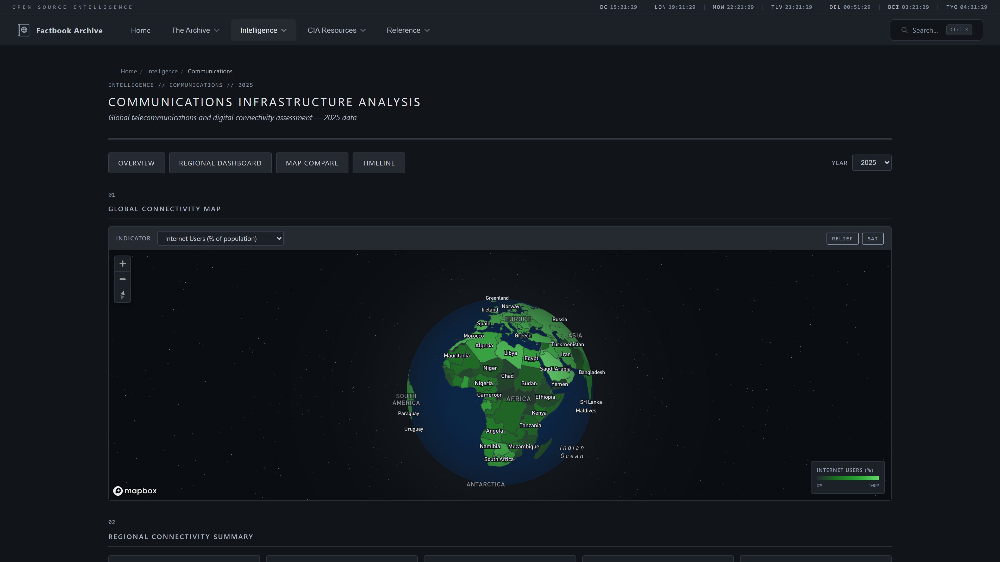 |  |
| **Communications Analysis** — Mapbox choropleth with internet, mobile, broadband indicators | **Intelligence Dossier** — Per-country assessment following ICD 203 standards |
|  | 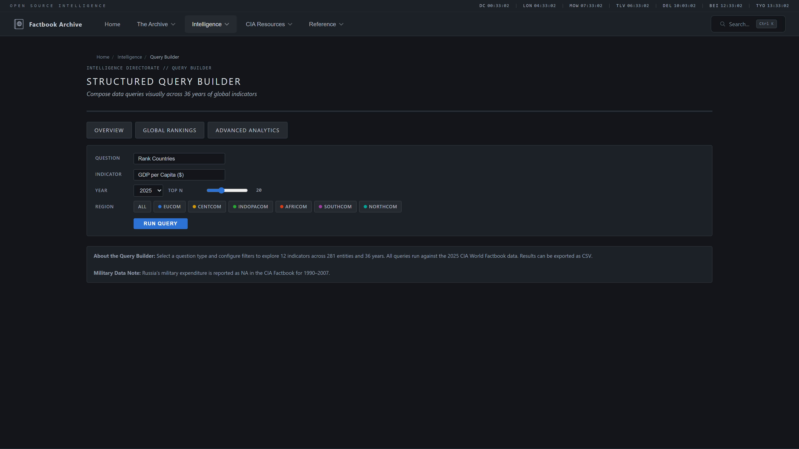 |
| **Trade Networks** — Geographic and force-directed graph of global trade relationships | **Query Builder** — Custom analytical queries across all indicators |
|  | 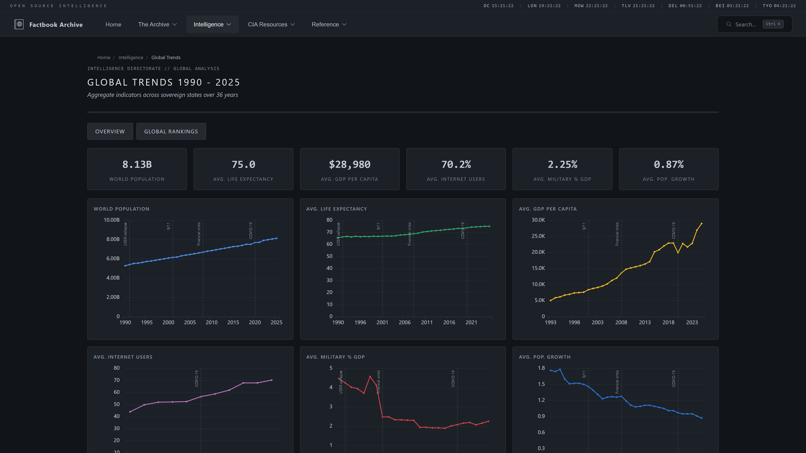 |
| **Global Rankings** — Sortable country rankings by any indicator | **Global Trends** — Multi-indicator time series across all editions |
| 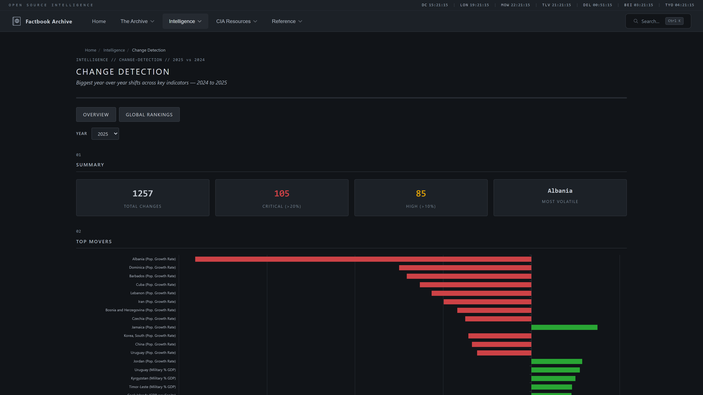 | 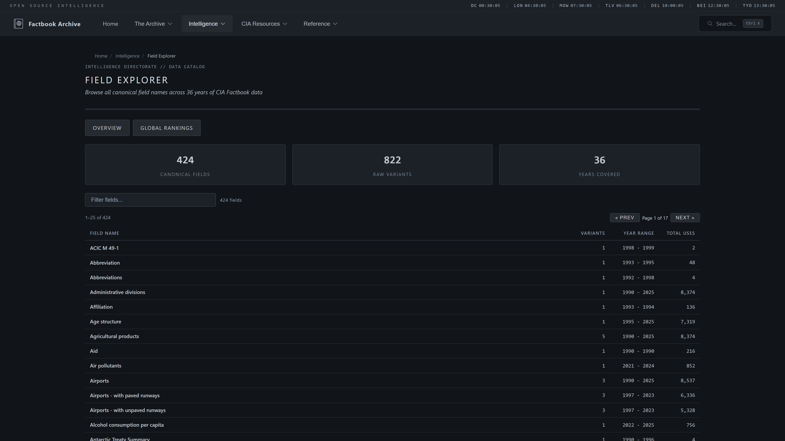 |
| **Change Detection** — Year-over-year field changes with trend charts | **Field Explorer** — Browse all data fields with coverage statistics |
| 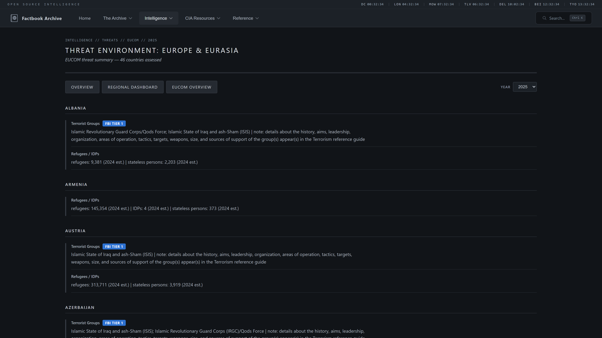 | 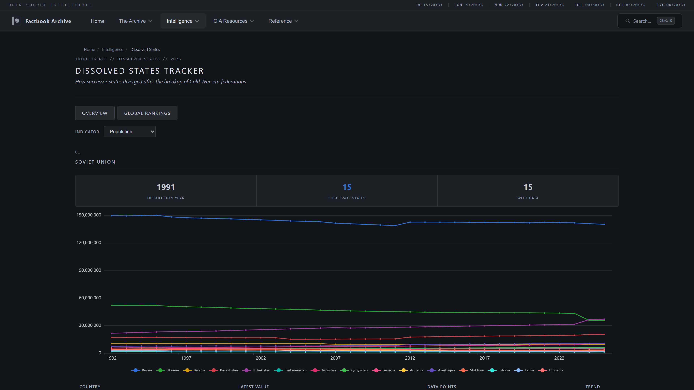 |
| **Regional Threat Brief** — COCOM-level instability and security indicators | **Dissolved States** — Historical entities no longer in the Factbook |
| 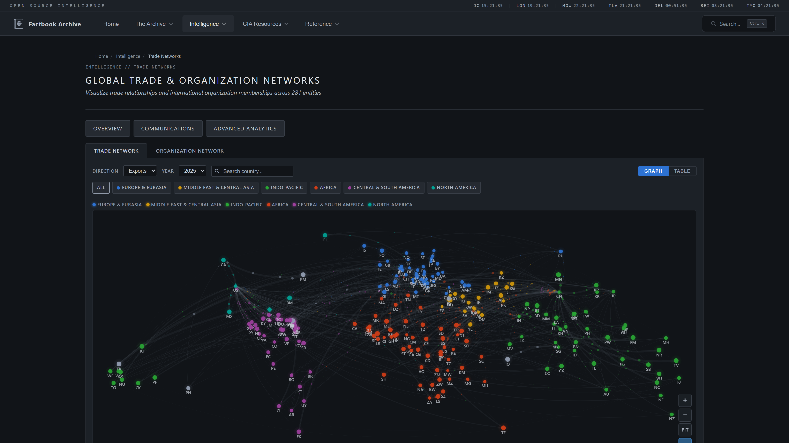 | |
| **Organization Networks** — International org memberships and alliances | |


## License

The CIA World Factbook is a work of the United States Government and is in the **public domain** (17 U.S.C. &sect; 105). This archive is released under [CC0 1.0 Universal (Public Domain Dedication)](LICENSE).

## About

The CIA World Factbook was first published in 1962 as a classified document and made publicly available starting in 1971. The online edition launched in the 1990s and was updated weekly until its discontinuation on February 4, 2026.

This archive was built as a preservation project to ensure this unique longitudinal dataset remains accessible for researchers, analysts, and the public.
