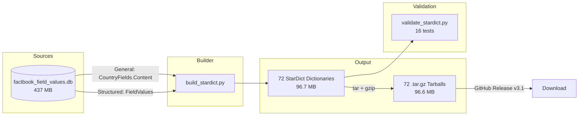
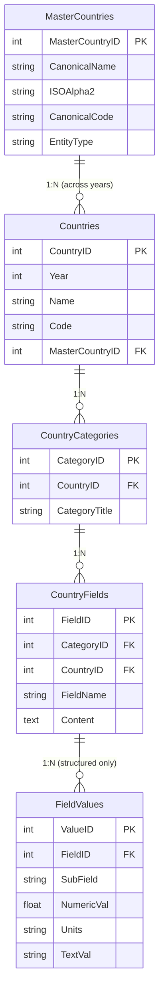
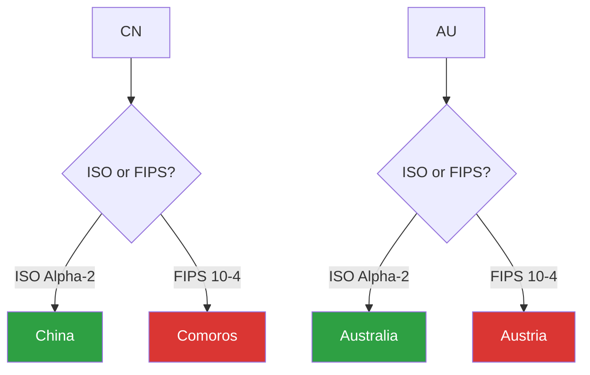
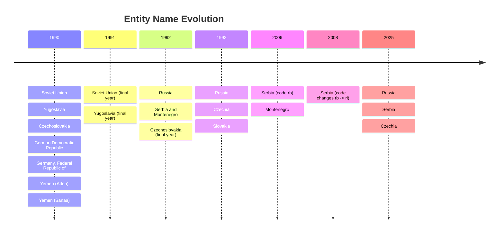

# StarDict Dictionaries -- Design & Release Document

> **Status**: Complete
> **Location**: `etl/stardict/`
> **Date**: 2026-02-28

---

## Why This Exists

[Issue #10](https://github.com/MilkMp/CIA-World-Factbooks-Archive-1990-2025/issues/10) included a request from the KOReader community for CIA Factbook data in StarDict format -- an open binary dictionary format supported by offline e-reader apps ([KOReader](https://koreader.rocks/), [GoldenDict](http://goldendict.org/), and others). The structured field parsing pipeline (see [DESIGN.md](../structured_parsing/DESIGN.md)) made this possible by decomposing raw text into queryable sub-values.

**72 dictionaries** cover 36 years (1990-2025) in two editions, totaling ~97 MB compressed. Each dictionary contains every country and territory the CIA published that year, searchable by name, ISO Alpha-2 code, or FIPS 10-4 code.

---

## Architecture



The builder reads from a single SQLite database that contains all 6 tables (MasterCountries, Countries, CountryCategories, CountryFields, FieldNameMappings, FieldValues). General edition uses `CountryFields.Content` (raw text); Structured edition uses `FieldValues` (parsed sub-values).

---

## StarDict Format

StarDict is a binary dictionary format originally designed for the StarDict desktop app. Each dictionary is a directory containing 4 files:

```mermaid
block-beta
    columns 2

    block:ifo["<b>.ifo</b> (text)":2]
        columns 1
        ifo_desc["Metadata: title, word count,<br/>author, date, format type"]
    end

    block:idx["<b>.idx</b> (binary)"]
        columns 1
        idx_desc["Word index: sorted headwords<br/>with byte offsets into .dict"]
    end

    block:dict["<b>.dict.dz</b> (gzip)"]
        columns 1
        dict_desc["Definitions: HTML content<br/>dictzip-compressed"]
    end

    block:syn["<b>.syn</b> (binary)"]
        columns 1
        syn_desc["Synonyms: ISO/FIPS codes<br/>mapped to entry indices"]
    end
```

### Binary Layout

**.idx** -- sorted word entries:
```
[word_1 UTF-8] \x00 [offset: 4 bytes BE] [size: 4 bytes BE]
[word_2 UTF-8] \x00 [offset: 4 bytes BE] [size: 4 bytes BE]
...
```

**.syn** -- synonym mappings:
```
[synonym UTF-8] \x00 [entry_index: 4 bytes BE]
...
```

**.dict.dz** -- dictzip (gzip with random-access index), containing raw HTML definitions concatenated end-to-end. The offset/size from `.idx` locates each entry.

---

## Two Editions

Each year produces two dictionaries:

### General Edition

Raw field text grouped by category. Preserves the CIA's original narrative descriptions.

```html
<h3>Geography</h3>
<b>Area</b>: total: 9,833,517 sq km
land: 9,147,593 sq km
water: 685,924 sq km<br>
<b>Climate</b>: mostly temperate, but tropical
in Hawaii and Florida...<br>

<h3>People and Society</h3>
<b>Population</b>: 341,963,408 (2025 est.)<br>
```

### Structured Edition

Parsed sub-values from the FieldValues table. Compact, machine-readable format.

```html
<h3>Geography</h3>
<b>Area</b><br>
&nbsp;&nbsp;total: 9,833,517 sq km<br>
&nbsp;&nbsp;land: 9,147,593 sq km<br>
&nbsp;&nbsp;water: 685,924 sq km<br>

<h3>People and Society</h3>
<b>Population</b><br>
&nbsp;&nbsp;total: 341,963,408<br>
&nbsp;&nbsp;growth_rate: 0.46%<br>
```

**When to use which:**
- **General** -- reading, research, browsing full CIA narratives
- **Structured** -- data extraction, comparison, numeric analysis

---

## Source Database Schema

The builder queries this path through the database:



**General query** joins Countries -> CountryCategories -> CountryFields and reads `Content`.

**Structured query** extends the chain to FieldValues and reads `SubField`, `NumericVal`, `Units`, `TextVal`.

Both queries use `co.Name` (period-accurate CIA name) as the headword, not `mc.CanonicalName` (modern successor name).

---

## Synonym Resolution

Each dictionary entry can have up to 3 headwords: the country name, its ISO Alpha-2 code, and its FIPS 10-4 code. Two collision problems had to be solved:

### Problem 1: ISO vs FIPS Collisions (98 cases)

The CIA uses both ISO Alpha-2 and FIPS 10-4 codes. These systems assign different 2-letter codes to the same countries, creating 98 collisions where one system's code for Country A is the other system's code for Country B.



**Rule:** ISO always wins. FIPS codes are only added as synonyms when they don't collide with any ISO code.

### Problem 2: Shared ISO Codes (6 code groups)

Some ISO codes are shared between a sovereign nation and its territories (e.g., `AU` applies to Australia, Ashmore and Cartier Islands, and Coral Sea Islands).

**Rule:** Sovereign nations own their ISO code. Territories keep only their unique FIPS code (if non-colliding).

| ISO Code | Owner (sovereign) | Also used by |
|----------|-------------------|--------------|
| AU | Australia | Ashmore and Cartier Islands, Coral Sea Islands |
| GB | United Kingdom | Guernsey, Isle of Man, Jersey |
| RE | Reunion | Bassas da India, Europa Island, Glorioso Islands, Juan de Nova Island |
| UM | US Minor Outlying Islands | 10 individual island entries |
| PF | French Polynesia | Clipperton Island |
| PS | West Bank | Gaza Strip |

---

## Historical Entity Handling

The builder uses `co.Name` (the CIA's original name for that year) instead of `mc.CanonicalName` (modern successor name). Entries are grouped by `co.CountryID` to keep split entities separate.



---

## Data Quality Fixes

Six issues were found and fixed during validation:

| # | Issue | Scope | Root Cause | Fix |
|---|-------|-------|------------|-----|
| 1 | ISO/FIPS synonym collision | 98 code pairs | FIPS codes overlapping ISO codes | Drop colliding FIPS codes |
| 2 | Shared ISO codes | 6 code groups | Territories sharing sovereign's ISO | Sovereign-wins ownership map |
| 3 | Historical entity names | 1990-1992 entries | Used `mc.CanonicalName` instead of `co.Name` | Query `co.Name` for period-accurate names |
| 4 | Entity merging | 1990 Germany, Yemen | Grouped by `MasterCountryID` | Group by `CountryID` instead |
| 5 | Serbia 2008 duplicate | 1 entry | CIA code change rb->ri left two rows | Merge entries, fix source databases |
| 6 | Encoding corruption | 37 fields, 80 chars | Windows-1252 bytes decoded as UTF-8 | Identified correct chars from original CIA HTML |

All fixes applied to source databases (`factbook.db`, `factbook_field_values.db`, SQL Server) via `etl/fix_encoding_and_duplicates.py`.

---

## Entry Counts & Sizes

### Entries Per Year

| Era | Years | Source Format | Entries/Year | Synonyms/Year |
|-----|-------|---------------|-------------|---------------|
| 1990-1991 | 2 | old/tagged text | 246-248 | 317-320 |
| 1992 | 1 | colon text | 263 | 344 |
| 1993-2000 | 8 | asterisk/atsign | 266-267 | 346-348 |
| 2001-2005 | 5 | equals/HTML | 265-271 | 346-355 |
| 2006-2020 | 15 | HTML | 259-268 | 333-349 |
| 2021-2025 | 5 | JSON | 260 | 328-331 |

### Dictionary Size Progression

| Year | General | Structured | Total |
|------|---------|-----------|-------|
| 1990 | 625 KB | 492 KB | 1,117 KB |
| 1995 | 914 KB | 650 KB | 1,564 KB |
| 2000 | 1,045 KB | 806 KB | 1,851 KB |
| 2005 | 1,230 KB | 935 KB | 2,165 KB |
| 2010 | 1,674 KB | 1,160 KB | 2,834 KB |
| 2015 | 2,140 KB | 1,540 KB | 3,680 KB |
| 2020 | 2,593 KB | 1,765 KB | 4,358 KB |
| 2025 | 2,222 KB | 1,443 KB | 3,665 KB |

General edition is consistently larger because it contains full narrative text. Structured is more compact with only parsed sub-values. The 2025 drop reflects the CIA's format simplification in the JSON era.

---

## Validation

16 tests verify dictionary correctness across all 72 dictionaries:

| # | Test | What It Checks |
|---|------|---------------|
| 1 | File presence | All 288 files exist (4 per dict x 72) |
| 2 | No empty entries | Every entry has content |
| 3 | DB count match | Entry counts match database for all 36 years |
| 4 | H3 tags | Every entry has category headings |
| 5 | Gen/Struct match | Same country list in both editions per year |
| 6 | No duplicates | No repeated headwords within a dictionary |
| 7 | Min size | No entries under 50 bytes |
| 8 | ISO synonyms | 15 critical country codes resolve correctly |
| 9 | HTML balance | Opening/closing tag counts match |
| 10 | Edition differs | General and Structured content is distinct |
| 11 | Ground truth | 50 data points verified against authoritative sources |
| 12 | Sub-fields | 20 countries have structured sub-values |
| 13 | Historical names | Soviet Union (1990), Yugoslavia (1991), Czechia (2025) |
| 14 | Encoding | 0 replacement characters across 330M bytes |
| 15 | Name match | All database country names present in dictionaries |
| 16 | Round-trip read | pyglossary reads back all entries correctly |

**Confidence score: 99.5%** -- see [VALIDATION_REPORT.md](VALIDATION_REPORT.md) for full details.

Run validation:
```bash
python etl/stardict/validate_stardict.py
```

---

## Usage

### Generate Dictionaries

```bash
pip install pyglossary python-idzip

python etl/stardict/build_stardict.py                    # all 72 dictionaries
python etl/stardict/build_stardict.py --years 2025       # just 2025 (2 dicts)
python etl/stardict/build_stardict.py --editions general # general only (36 dicts)
python etl/stardict/build_stardict.py --no-compress      # uncompressed .dict files
```

Output goes to `data/stardict/`. Each dictionary is a directory with 4 files.

### Install on KOReader

1. Download the `.tar.gz` from the [GitHub Release](https://github.com/MilkMp/CIA-World-Factbooks-Archive-1990-2025/releases)
2. Extract the archive
3. Copy the dictionary folder to `koreader/data/dict/` on your device
4. Open any book, long-press a country name to look it up

### Install on GoldenDict

1. Download and extract the `.tar.gz`
2. In GoldenDict: Edit > Dictionaries > Sources > Add the extracted folder
3. Search for any country name or ISO/FIPS code

---

## Scripts Reference

| Script | Lines | Purpose |
|--------|-------|---------|
| `build_stardict.py` | ~470 | Build 72 StarDict dictionaries from SQLite databases |
| `validate_stardict.py` | ~310 | Run 16 deep validation tests on all dictionaries |
| `fix_encoding_and_duplicates.py` | ~200 | Fix encoding corruption and Serbia 2008 duplicate in source databases |
